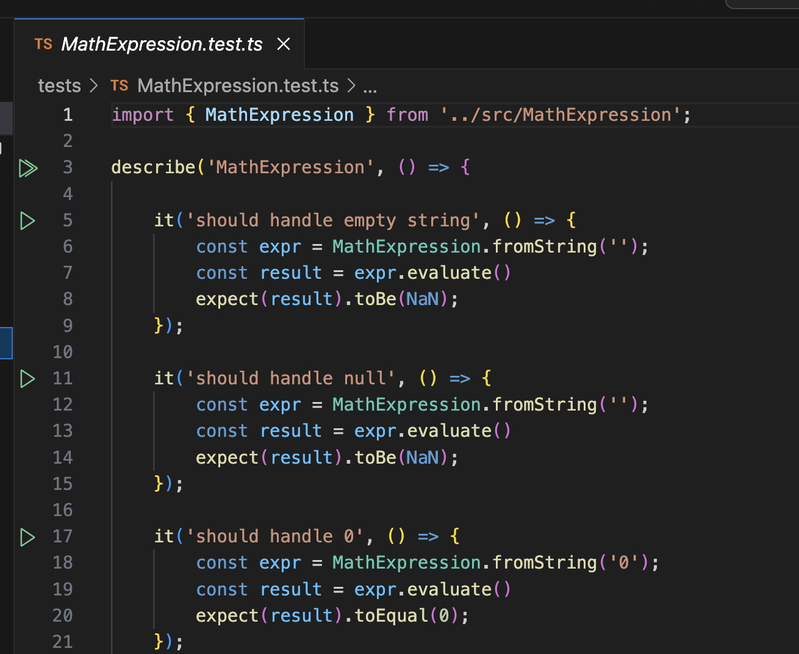

# Solution 1

Tree in Typescript

# Prerequisites

Requires the following installed locally:

* [Node](https://nodejs.org/en/download) - v20.9.0 was used
* [Typescript](https://www.typescriptlang.org/download) 

```
# Install node first then
npm install -g typescript
```

# Setup

```bash
cd solution_1

# Install dev items to support tests
npm install
npm run build
```

## View Tests in Visual Studio Test Explorer

_First: exit Visual Studio Code completely, after installing via `npm install`_

```bash
cd solution_1
code . --goto ./tests/MathExpression.test.ts
```



## View in Browser

```bash
npx serve
```

* Language: Typescript
* Test framework: Jest
* Method: Parse expression to [AST](https://dev.to/balapriya/abstract-syntax-tree-ast-explained-in-plain-english-1h38), evaluate AST

Challenges:

* Assigning precedence to the operators.
* Inserting a node correctly into the tree.

# Algorithm

This solution does the following:

1. Parse expression to an abstract syntax tree
    * operator nodes are decorated with the precedence as well
2. Evaluate the tree in pre-order traversal.

## Precedence

The `5` here represents _any_ number, including `0`, `85` and `4.1`.

| operator |  name     |  precedence |
|----------|-----------|-------------|
|   `5`    | number    |    `null`   |
|   `^`    | power     |    `10`     |
|   `x`    | multiply  |    `20`     |
|   `-`    | subtract  |    `30`     |

For now unary operators such as `-5` and also parentheses are not supported.

Also there's only one operator for each precedence level as the others are trivially added.

Note that we calculated the precedence once for each operator node and store it with the
operator, effectively memo-izing it for that node.

## Precedence and AST nodes

To build the tree I used nodes that have alternate structure:

* value nodes - always a leaf node: 

```javascript
{ 
    num: 5, 
    op: null, 
    prec: null
}
```

* operations  - always a non-leaf node: 

```javascript
{ 
    num: null, 
    op: `multiply`, 
    prec: 20
}
```

Note that for brevity I have not shown the child node object members above.

## Evaluation

Evaluation is not challenging. Once the tree is correctly constructed its
a pre-order traversal with the follow pseudo-code:

_Evaluate()_  
* Case 1: Operator
1. LHS.Evaluate() (recursive call) -> rhs: number
2. RHS.Evaluate() (recursive call) -> lhs: number
3. _return_ Operator(LHS, RHS)
* Case 2: Number
1. _return_ number

## Insertion by Precedence

Consider `7 * 5 * 3 - 2 * 8 ^ 2`

We **first** parse out the `7`, creating a tree with a _root_ of a single number node. 
**Then** for each successive _operator and number pair_ we ask the _root_ to insert
the node in the correct position, based on precedence.

We treat the AST as having a root at the top, and the leaves at the bottom. The tree
to be well-formed for evaluation must have the following property:

* Each node must have _higher_ precedence than its children.

When the tree is well-formed in this way we can evaluate the tree by performing
a _pre-order tree traversal_.

Note that mathematical expressions as well as having precedence by operator,
must also be evaluated from left to right, for values having the same precedence.

For this reason when inserting in the AST we cannot easily do any rebalancing, 
and the node has to be inserted to the right of the node being examined.

### Insertion Above

After parsing `7`, `* 5`, and `* 3` into the AST along with their operators
we get the token pair `- 2` with precedence `30`, where the root of the tree 
has precedence `20` for the multiply node:


We examine the root, and ask it to insert `- 2`. Since the node being examined (the root of `x`) has precedence of `20`, which is **_less_** than `30` the new node is inserted above.


### Insertion below

After parsing `7`, `* 5`, `* 3` and `- 2` into the AST along with their operators
we get the token pair ` * 8`, where the root of the tree has precedence `30` for
the subtract node:


Since the `(x) -> 8` node has operator precedence `20` it must go below the `(-) -> 2` node. When this _insert underneath_ happens, the tree has to be altered by moving the current child node
to be the child of the incoming node:


### Cascade and Return Insertion Point

In a larger expression the examined node can cascade down, and each node that has to 
execute an _Insert below_ operation must check with its right hand child to see if _that
child_ must handle the insert.


The steps here are:

1. `(-)` substract node prec `30` (root) examined
2. Call on it to insert `(^) -> 2`, prec `10`
2. `(-)` subtract checks rhs child, it has `30`, so...
3. `(x: 2, 8)` node examined
4. Call on it to insert `(^) -> 2` (recursive call to insert)


